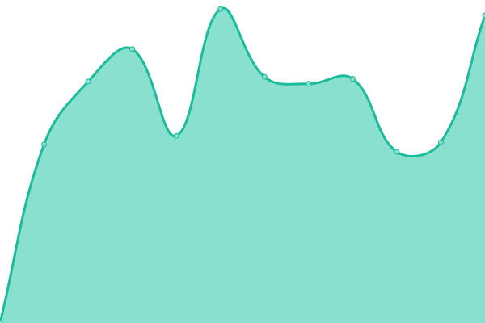

# [📈 Live Status](https://chiang.github.io/mtr): <!--live status--> **🟥 Complete outage**

This repository contains the open-source uptime monitor and status page for [박영일](www.ucomp.co.kr), powered by [Upptime](https://github.com/upptime/upptime).

With [Upptime](https://upptime.js.org), you can get your own unlimited and free uptime monitor and status page, powered entirely by a GitHub repository. We use [Issues](https://github.com/chiang/mtr/issues) as incident reports, [Actions](https://github.com/chiang/mtr/actions) as uptime monitors, and [Pages](https://chiang.github.io/mtr) for the status page.

<!--start: status pages-->
<!-- This summary is generated by Upptime (https://github.com/upptime/upptime) -->
<!-- Do not edit this manually, your changes will be overwritten -->
<!-- prettier-ignore -->
| URL | Status | History | Response Time | Uptime |
| --- | ------ | ------- | ------------- | ------ |
|  [New MasterTopik](https://www.mastertopik.com/api/v1/courses?name=504&page=0&size=8) | 🟥 Down | [new-master-topik.yml](https://github.com/chiang/mtr/commits/HEAD/history/new-master-topik.yml) | 

 1458ms
     
 | 

<a href="https://chiang.github.io/mtr/history/new-master-topik">100.00%</a>
    

<!--end: status pages-->

[**Visit our status website →**](https://chiang.github.io/mtr)

## 📄 License

- Powered by: [Upptime](https://github.com/upptime/upptime)
- Code: [MIT](./LICENSE) © [박영일](www.ucomp.co.kr)
- Data in the `./history` directory: [Open Database License](https://opendatacommons.org/licenses/odbl/1-0/)
